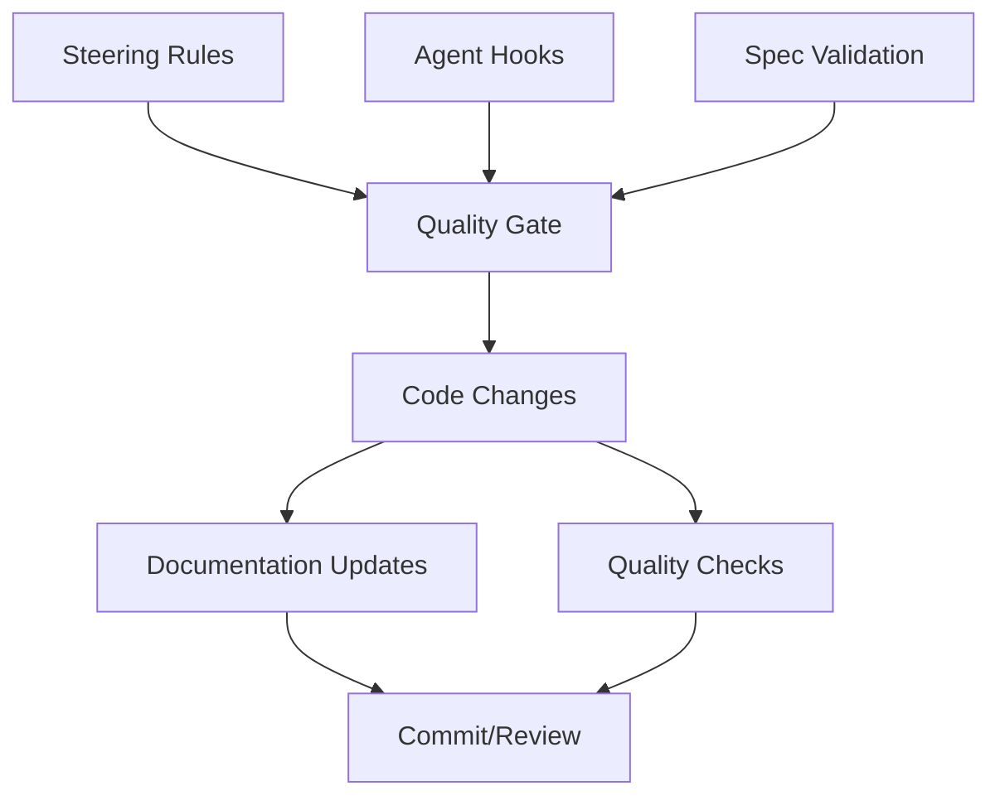

# Development Guidelines Design Document

## Overview

This design document outlines the implementation of automated development guidelines and quality assurance mechanisms for the Linux Fingerprint Scanner Driver project. The system will use Kiro's steering, hooks, and spec capabilities to enforce development standards and maintain code quality.

## Architecture

The development guidelines system consists of four main components:



## Components and Interfaces

### 1. Steering Rules Engine

**Purpose**: Provide contextual guidance and enforce development standards during all interactions.

**Key Files**:
- `.kiro/steering/project-context.md` - Project understanding requirements
- `.kiro/steering/documentation-sync.md` - Documentation maintenance rules
- `.kiro/steering/code-quality.md` - Code quality standards
- `.kiro/steering/modularity.md` - Modular architecture enforcement

**Interface**: Automatically included in all agent interactions to provide consistent guidance.

### 2. Agent Hooks System

**Purpose**: Trigger automated quality checks and documentation updates at key development events.

**Hook Types**:
- **Pre-commit Hook**: Validate code quality, check file sizes, update documentation
- **File Save Hook**: Check for redundancy, update related documentation
- **New File Hook**: Verify necessity, check for duplicates, create documentation templates
- **Code Review Hook**: Comprehensive quality assessment

**Interface**: Event-driven triggers that execute validation and maintenance tasks.

### 3. Spec-Driven Validation

**Purpose**: Ensure all development activities align with project requirements and maintain traceability.

**Components**:
- Requirement validation against changes
- Architecture compliance checking
- Feature scope verification
- Documentation completeness validation

**Interface**: Validation engine that checks all changes against defined specifications.

### 4. Quality Gate Controller

**Purpose**: Central orchestration of all quality checks and enforcement mechanisms.

**Responsibilities**:
- Coordinate between steering, hooks, and specs
- Maintain quality metrics
- Generate compliance reports
- Enforce blocking conditions for non-compliant changes

## Data Models

### Code Quality Metrics
```typescript
interface QualityMetrics {
  fileLineCount: number;
  commentRatio: number;
  duplicateCodeScore: number;
  complexityScore: number;
  documentationCoverage: number;
  testCoverage: number;
}
```

### Project Context
```typescript
interface ProjectContext {
  currentObjective: string;
  activeComponents: string[];
  hardwareSpecs: HardwareSpec[];
  architectureConstraints: string[];
  qualityGates: QualityGate[];
}
```

### Documentation State
```typescript
interface DocumentationState {
  lastUpdated: Date;
  affectedByChanges: string[];
  completenessScore: number;
  syncStatus: 'current' | 'outdated' | 'missing';
}
```

## Error Handling

### Quality Gate Failures
- **File Size Violation**: Block commit, suggest refactoring
- **Missing Documentation**: Require documentation before proceeding
- **Code Duplication**: Highlight existing implementations, suggest reuse
- **Scope Deviation**: Alert and require justification

### Recovery Mechanisms
- Automated documentation generation for missing docs
- Refactoring suggestions for oversized files
- Code similarity analysis for duplication detection
- Architecture compliance checking

## Testing Strategy

### Unit Tests
- Steering rule validation
- Hook trigger mechanisms
- Quality metric calculations
- Documentation sync logic

### Integration Tests
- End-to-end development workflow
- Multi-component quality checks
- Documentation generation pipeline
- Compliance reporting

### Validation Tests
- Real development scenario testing
- Quality gate effectiveness
- Performance impact assessment
- Developer experience evaluation

## Implementation Phases

### Phase 1: Steering Rules Setup
1. Create project context steering files
2. Implement code quality guidelines
3. Set up documentation sync rules
4. Configure modularity enforcement

### Phase 2: Agent Hooks Implementation
1. Pre-commit quality validation hook
2. File save documentation sync hook
3. New file creation validation hook
4. Code review comprehensive check hook

### Phase 3: Spec Integration
1. Requirement traceability system
2. Architecture compliance checking
3. Feature scope validation
4. Documentation completeness verification

### Phase 4: Quality Gate Orchestration
1. Central quality controller
2. Metrics collection and reporting
3. Compliance dashboard
4. Automated remediation suggestions

## Configuration Management

### Steering Configuration
- Rule priority and precedence
- Context-sensitive activation
- Custom rule definitions
- Exception handling

### Hook Configuration
- Event trigger definitions
- Execution order and dependencies
- Timeout and retry policies
- Error handling strategies

### Quality Thresholds
- File size limits (300 lines)
- Comment ratio requirements (>20%)
- Duplication tolerance (<5%)
- Documentation coverage (>90%)

## Performance Considerations

### Optimization Strategies
- Incremental quality checks
- Cached analysis results
- Parallel validation execution
- Smart documentation updates

### Resource Management
- Memory-efficient code analysis
- Disk space management for metrics
- Network optimization for remote checks
- CPU usage monitoring and throttling

## Security Features

### Code Security
- Static analysis integration
- Vulnerability scanning
- Secure coding pattern enforcement
- Dependency security validation

### Access Control
- Quality gate bypass permissions
- Configuration modification rights
- Metrics access control
- Audit trail maintenance

## Monitoring and Metrics

### Quality Metrics
- Code quality trends
- Documentation coverage
- Compliance rates
- Developer productivity impact

### Performance Metrics
- Hook execution times
- Quality check duration
- Documentation sync speed
- System resource usage

### Alerting
- Quality gate failures
- Documentation drift
- Performance degradation
- Security vulnerability detection